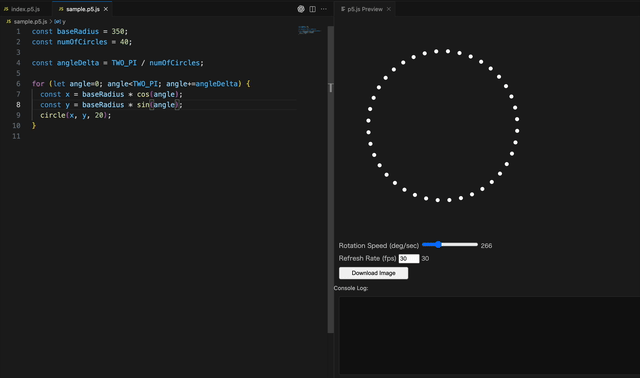

# p5-phena

Live-code phenakistoscopes with p5.js! **p5-phena** renders the sketch from your active editor inside a VS Code webview and layers intuitive controls on top of the preview. With code and output side by side, you can iterate on spinning animations in real time without breaking flow.

## Features

- **One-keystroke preview** – press `Ctrl+Enter` (`Cmd+Enter` on macOS) in a `.p5.js` file to open or refresh the live preview.
- **Single preview tab** – the extension reuses the same webview, so your workspace stays tidy.
- **Live controls** – adjust rotation speed (deg/sec) with a slider and tweak the p5 frame rate directly from the preview.
- **Persistent settings** – rotation speed and FPS are remembered between runs.
- **Download snapshots** – export the current canvas as a PNG with one click.
- **Inline console** – view `console.log`, `console.warn`, and `console.error` output right below the preview.
- **Editor-first workflow** – the command runs without stealing focus from the code editor.

## Requirements

- Visual Studio Code **1.105.0** or newer.
- A sketch file saved with the `.p5.js` suffix (for example `sketch.p5.js`) so the keyboard shortcut and command targeting work as expected.

The extension bundles p5.js from the official CDN; no local installation is required.

## Usage

1. Open a `.p5.js` sketch in VS Code.
2. Hit `Ctrl+Enter` / `Cmd+Enter` or run **Run p5 phena** from the Command Palette.
3. Interact with the preview controls to fine-tune playback speed or frame rate.
4. Check the embedded console section for log output.
5. Use the **Download Image** button to capture the current canvas.

## Commands & Keybindings

| Command        | Description              | Default Keybinding                         |
|----------------|--------------------------|---------------------------------------------|
| `p5-phena.run` | Run / refresh the preview | `Ctrl+Enter` / `Cmd+Enter` |

## Extension Settings

This extension does not contribute any VS Code settings at the moment. Rotation speed and frame rate preferences are stored automatically using `localStorage`.

---

## Feedback & Contributions

If you encounter an issue or have ideas for improvements, please open an issue or pull request on the project repository.

Enjoy building with p5-phena! 🎨🧪

## License

Released under the [GNU Lesser General Public License v3.0](./LICENSE).
